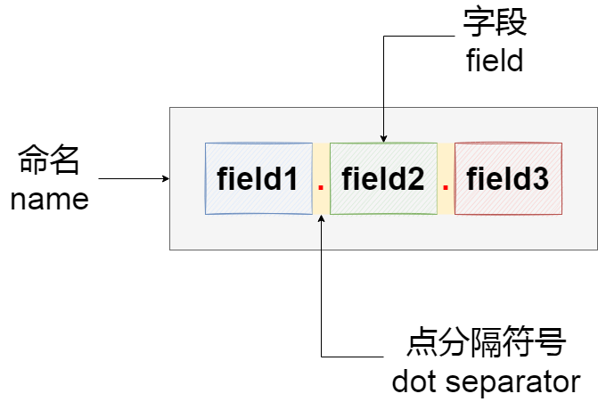

xcfg
====

示例：
```text
xcfg
'''
This is a description of test node, the description allows multiple lines.
Multi-line descriptions 
'''

xcfg.author # xcfg author node
xcfg.author.name = zoumingzhe # string type, default is null.
xcfg.author.alias = mingzhe # string type, default is null.
xcfg.author.age(number) = 30 # number type, default is null.
xcfg.author.gender(choice[man, woman], woman) # choice type, use default.
xcfg.author.hobbies(check[run, read, game, music]) = run, music
# check type, default is null, setting can be an array.
xcfg.author.gender = man
# update choice value to man, other attributes unchanged.

[xcfg.repo] # xcfg repo section node
.public(bool, false) = true # bool type, default is false.
.created(date) = 2023-02-18 # date type, default is null.
.link = https://github.com/zoumingzhe/xcfg # url(string type), default is null.

xcfg.type =
    bool
    string
    number
    array
    check
    choice
    datetime
    date
    time
    timezone
# bool type allow 0,1,true,false,True,False,TRUE,FALSE
# string type allow all characters
# number type allow 0-9 and dot(.)

xcfg.path.xcfg: command/xcfg
xcfg.path.xcfg-show: command/xcfg_show
```

## 命名（name）


命名（name）由字段（field）和点分隔符（dot separator）组成，点分隔符并不是必须的，命名也可以是一个独立字段。

所有命名必须顶格
字段中不允许出现空格


### 字段（field）

### 点分隔符（dot separator）


## 节点（node）
```
field1.field2.field3 # description
```

### 章节（section）
特殊的节点（node），具有相同前缀字段（field）的缩写形式。


### 根节点（root node）
特殊的节点（node），


```text
field1
field1.field2
field1.field3
```

或者

```text
[field1.field2.field3]
.field4
.field5
```


## 条目（item）
```
field1.field2.field3(type, default) = value # description
```


### 字段（field）

#### 字段分隔符（）

### 属性（attribute）

#### 类型（type）

#### 缺省值（default）

#### 连接符（joiner）

#### 设定值（set value）


### 描述（description）

#### 单行描述

#### 多行描述


### 续行符（）

